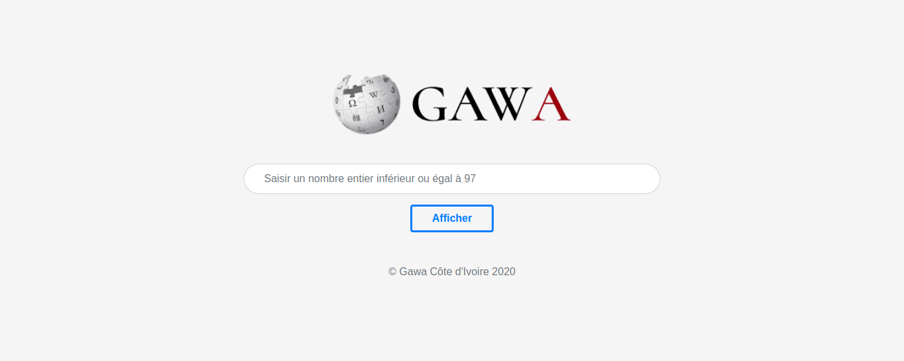

# GAWA CÔTE D'IVOIRE



C'est une application web qui a la capacité de générer les articles Wikipédia propre à la Côte d'Ivoire, présentant un bandeau de maintenance et nécessitant une amélioration.
Ce logiciel a été développé lors d'un Hack-a-Thon en ligne dénommé WIKIHACK CÔTE D'IVOIRE 2020.
Pour découvrir et tester cette application, je vous invite à vous rendre à l'adresse web suivante:
www.gawa.ci ou http://gawa.ci .


### Requirements

* [Python 3.x+](https://www.python.org/downloads/)
* [PIP (Python Dependency Manager)](https://pip.pypa.io/en/stable/installing/)

### Clone project

```$ git clone https://github.com/paulbouaffou/gawa-ci```

### Installation
* `pip install -r requirements.txt`
* `flask run --reload # optionally you add --port=5000`

### Quickstart the tool

* ```$ export FLASK_APP=app.py```
* ```$ export FLASK_ENV=development```
* ```$ flask run```

### On localhost
```$ localhost:5000```

### Link of website
```$ www.gawa.ci```

## Contributors

* [Paul Bouaffou](https://github.com/paulbouaffou) - Project Lead
* [Abdoulaye Fofana](https://github.com/abdoul007) - Contributor
* [Lamagnigui Touré](https://github.com/johnlightluc) - Contributor
* [Rolande Kouakou](https://github.com/krolande) - Contributor
* [Armand Noël Koffi](https://github.com/koffi-noel) - Contributor
* [Nick Jefferson HOBA](https://github.com/njefferson180) - Contributor

## License
This project is open source and available under the [MIT License](LICENSE).